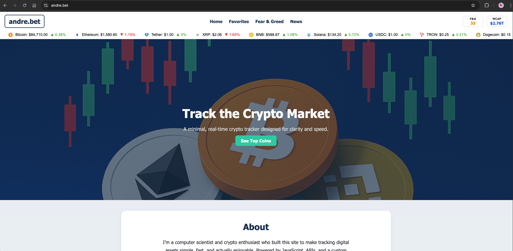

# andre.bet — Real-Time Crypto Tracker

[andre.bet](https://andre.bet) is a fast, minimalist crypto dashboard built for real-time price tracking, market insights, and clean design.

---

## 🌟 Features

- 🕒 **Real-Time Top Cryptocurrencies** — Live prices, % changes, and 30-day trends
- ⭐ **Favorite Coins** — Save and view your personal crypto watchlist
- 😨 **Fear & Greed Index** — Sentiment scores with historical Chart.js visualization
- 🌊 **Volatility Meter** — Daily volatility score with interactive explanation modal
- 📰 **Crypto News Feed** — Curated recent headlines with clean cards
- 📈 **Gainers & Losers Tracker** — 24h biggest movers displayed side-by-side
- 📱 **Responsive Design** — Optimized for desktop and mobile browsing

---

## 🛠️ Tech Stack

- **Frontend**: HTML5, CSS3, JavaScript
- **APIs & Data**: CoinGecko API, TradingView API, Coindesk API, Node.js Proxy (Render)
- **UI Libraries**: Chart.js, AOS Library, FontAwesome
- **Deployment**: Firebase

---

## 🔗 Live Site

🌐 [https://andre.bet](https://andre.bet)

---

## 🖼️ Preview

---

## 👨‍💻 Author

Designed and developed by **Andre Ashworth**  
🔗 [github.com/ashworth3](https://github.com/ashworth3)
